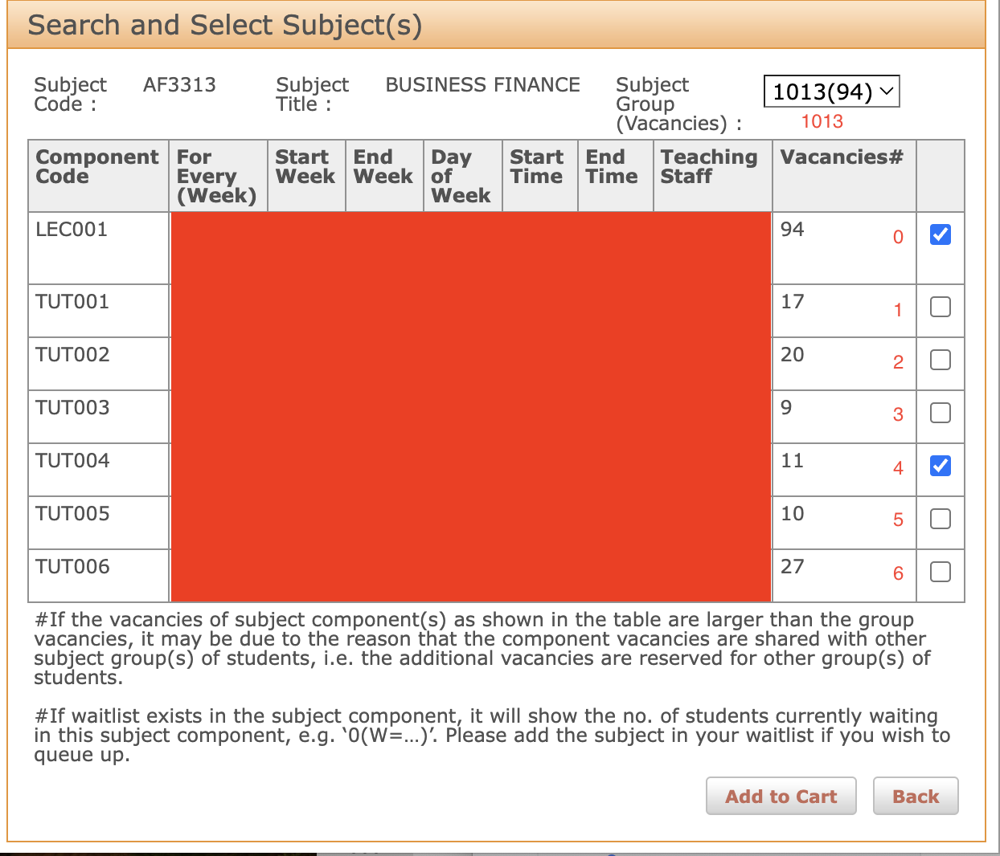

# PolyU AutoClass

PolyU的estudent 自动抢课软件

## 目录

- [安装](#安装)
- [使用](#使用)
- [贡献](#贡献)
- [联系我](#联系我)
- [许可证](#许可证)

## 安装

技术栈： Python3.10 + Selenium

```bash
# 克隆仓库
git clone https://github.com/Michalai0/AutoClass.git

# 进入项目目录
cd AutoClass

# 安装依赖
pip install -r requirements.txt

```

## 使用

打开 `main.py` 修改一下代码：
```
mock = True       #是否是mock注册
wait = False      #是否在正式注册前在也面刷新等待，注册开放
proceed_each = False    #是否在每次添加/修改课程后Proceed and Confirm， False会在全部课程添加之后再Proceed and Confirm
subject_list = [["AF3313", "1013", [0, 4]]....] #List中第一个是Subject Code，第二个是Subject Group，第三个是课程时间列表，课程列表中每个元素是[第几个time table，从第0开始]
username = "your-username"  #NetID
password = "your-password"  #NetID Password
```
### Subject List 示例
`["AF3313", "1013", [0, 4]]`


### 运行
```bash
python main.py
```


## 贡献
描述如何贡献代码和参与项目。
1. Fork 仓库
2. 创建特性分支 (git checkout -b feature/AmazingFeature)
3. 提交更改 (git commit -m 'Add some AmazingFeature')
4. 推送到分支 (git push origin feature/AmazingFeature)
5. 打开一个 Pull Request

## 联系我

VX: Michalai
## 许可证
Distributed under the MIT License. See LICENSE for more information.

```
Copyright (c) <year> <copyright holders>

Permission is hereby granted, free of charge, to any person obtaining a copy of this software and associated documentation 
files (the "Software"), to deal in the Software without restriction, including without limitation the rights to use, copy, 
modify, merge, publish, distribute, sublicense, and/or sell copies of the Software, and to permit persons to whom the 
Software is furnished to do so, subject to the following conditions:

The above copyright notice and this permission notice shall be included in all copies or substantial portions of the Software.

THE SOFTWARE IS PROVIDED "AS IS", WITHOUT WARRANTY OF ANY KIND, EXPRESS OR IMPLIED, INCLUDING BUT NOT LIMITED TO THE 
WARRANTIES OF MERCHANTABILITY, FITNESS FOR A PARTICULAR PURPOSE AND NONINFRINGEMENT. IN NO EVENT SHALL THE AUTHORS OR 
COPYRIGHT HOLDERS BE LIABLE FOR ANY CLAIM, DAMAGES OR OTHER LIABILITY, WHETHER IN AN ACTION OF CONTRACT, TORT OR OTHERWISE, 
ARISING FROM, OUT OF OR IN CONNECTION WITH THE SOFTWARE OR THE USE OR OTHER DEALINGS IN THE SOFTWARE.
```